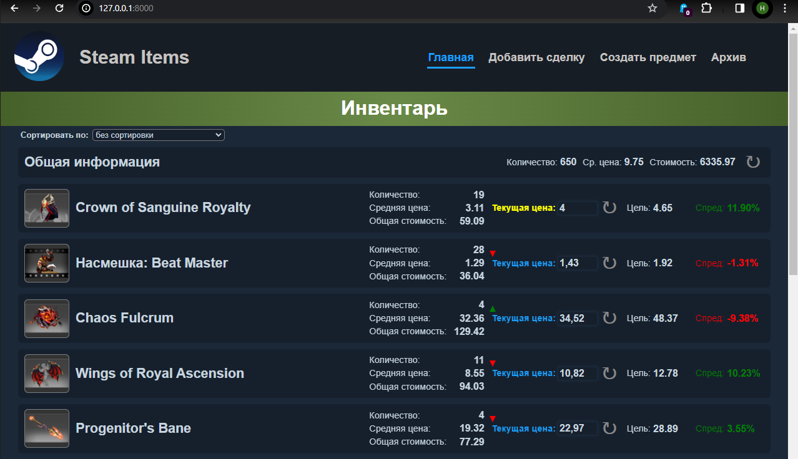
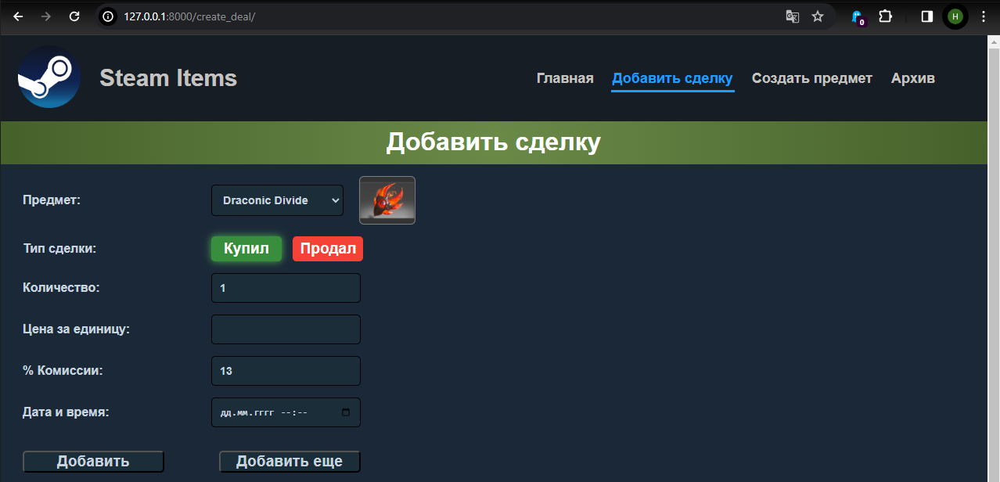

<h1 align="center"> 
  
</h1>

<h2 align="center">🚀 I'm a passionate backend developer 🚀</h2>

&nbsp;&nbsp;&nbsp;&nbsp;🌟 I'm amazed at how Python and programming in general can model almost any situation that happens in our lives. It's incredibly fascinating and utterly captivating!

&nbsp;&nbsp;&nbsp;&nbsp;🎯 I specialize in backend development using Python. I enjoy creating efficient and scalable solutions that can handle large volumes of data and provide high performance.

&nbsp;&nbsp;&nbsp;&nbsp;🌍 My goal is to use my skills and knowledge to create products that can improve people's lives and make the world a little better. Let's work together to create something amazing!

  

---

<h2> 🛠️ Technologies & Tools</h2>

|Main|
|:-:|
|          |
|**Experienced**|
|       |
|**Explore & Use**|
|    |
|**Tools**|
|    |

---

<h2> 📂My portfolio:</h2>
<h3>🛒 Grocery_assistant</h3>

For more details click below

The Grocery Assistant app is a website where users will publish recipes, add other people's recipes to favorites and subscribe to publications by other authors.
  

<a href="https://github.com/AnatoliiBessmertnyi/grocery_assistant">Project on git</a>

<h3>📖 Social_network_live_journal</h3>

For more details click below

You can create your diary, read others', follow authors and enjoy there publications on subscription page.

<a href="https://github.com/AnatoliiBessmertnyi/social_network_final">Project on git</a>

<h3>💰 Steam_price_Tracker</h3>

For more details click below

You can create deal for items on the Steam trading platform, track current prices, which makes trading more convenient.

<a href="https://github.com/AnatoliiBessmertnyi/steam_items">Project on git</a>

<h3>📚 Books_reviews_platform</h3>

For more details click below

Here you can add your review to any book, rate it, cooment others' reviews.

<a href="https://github.com/AnatoliiBessmertnyi/books_reviews_platform">Project on git</a>

<h3>🤖 Telegram_bot</h3>

For more details click below

Bot assistant for parsing the status of homework verification in Yandex.Practicum.

<a href="https://github.com/AnatoliiBessmertnyi/homework_tg_bot">Project on git</a>

<h3>🏃‍♂️ Fitness_tracker</h3>

For more details click below

A fitness tracker software module that processes data for three types of workouts: running, walking and swimming.

<a href="https://github.com/AnatoliiBessmertnyi/fitness_track_project">Project on git</a>

---
  
<h2> :bar_chart: My GitHub Stats</h2>

---

<h2>📫 Contacts</h2>
 
